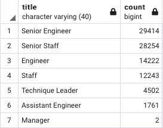
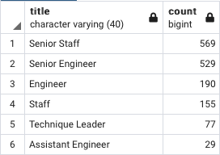
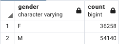
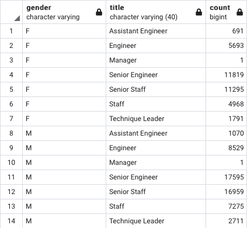
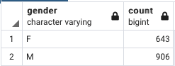
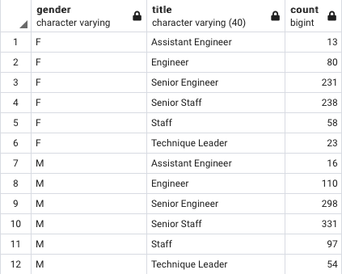

# Pewlett-Hackard-Analysis

## Overview of the analysis: 
The purpose of the analysis is to determine the number of retiring employees per title, and identify employees who are eligible to participate in a mentorship program. 

## Results: 
Provide a bulleted list with four major points from the two analysis deliverables. Use images as support where needed.

- There is a total of 90,398 employees that will be retiring. 
- The two biggest positions that will need to be filled are Senior Engineers and Senior Staff. 
- The title that will have the most vacant position is Senior Engineers with 29414.
 

- There is a total of 1,549 employees that are eligible for the mentoriship program.
- The position with the most eligible employees for the mentorship program is the Senior Staff with 569.
- No Managers eligible for the mentorship program.

## Summary: 
How many roles will need to be filled as the "silver tsunami" begins to make an impact?
The "silver tsunami" will leave a total of 90,398 roles that need to be filled. Also, there is not enough qualified emloyees in the department to mentor the nect generation. For example, of the 29,414 Senior Engineer only 529 are eligible to mentor. Assuming they need to hire 29,414 new employees there will be a mentee to mentor ratio of 56:1. That means that every mentor will have about 56 mentees. 

In order to get a better understanding of the employees that are retiring we can look at the tables below. Of the 90,398 employees that are retiring 36,258 are Female and 54,140 are Male. The positions with the most available roles previously occupied by a female is the Senior Engineer role. The position with the most available roles previously occupied by a male is the Senior Engineer.

Of the 1,549 employees eligible to mentor 643 are Female and 906 are male. The role with the most available mentors for females is Senior Staff. The role with the most available mentors for males is Senior Staff.

